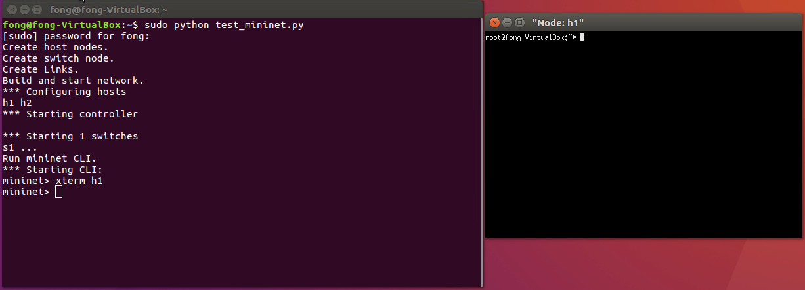
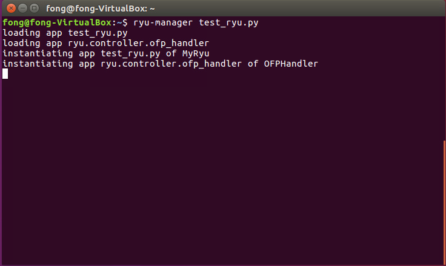

# 測試環境:ubuntu 16.04 LTS

# 套件安裝流程

### 1.更新apt-get
```console
sudo apt-get update
```
### 如圖


### 2.利用apt-get 安裝mininet
```console
sudo apt-get install mininet
```

### 3.測試mininet
```console
sudo mn --test pingall
```
### 如圖

### 4.利用 apt-get 安裝 pip
```console
sudo apt-get install python-pip
```

### 5.利用pip安裝ryu controller 
```console
sudo pip install ryu
```

### 6. 測試ryu  
```console
ryu-manager
```
### 如圖即為成功畫面


### 7.安裝curl 以使用  restful
```console
sudo apt-get install curl
```
<b> <hr> </b>

# Mininet in Python code

### 完整程式碼參考test_mininet.py

### 引用相關模組
```python
from mininet.log import setLogLevel, info
from mininet.net import Mininet
from mininet.cli import CLI
```

### 建立網路
```python
net = Mininet()
```

### 顯示提示訊息
```python
info("訊息內容\n")
```

### 加入host
```python
lefthost = net.addHost("h1")
```

### 加入switch
```python
switch = net.addSwitch("s1", failMode = 'standalone')
```

### 將host與switch連接在一起
```python
net.addLink(lefthost, switch)
```

### 建立與開始網路
```python
net.build()
net.start()
```

### 開啟Mininet 的 Command Line Interface(CLI)
```python
CLI(net)
```


### 基本拓樸的架構

<b> <hr> </b>

### 測試自行建立的拓樸
```console
sudo python test_mininet.py
```


### 以xterm 開啟節點（node）
```console
mininet > xterm [節點名稱]
```




<b> <hr> </b>

### 使用SDN架構 (OVS switch & Controller)

### 完整程式碼參考test_ryu_base_mininet.py
```python
# Add OVS switch
switch = net.addSwitch("s1", switch=OVSSwitch, protocols = 'OpenFlow13', failMode = 'secure')
# Add controller node
net.addController(name='c1',controller=RemoteController,ip='127.0.0.1',port=6633)
```

# 自訂Ryu controller 

### 引用相關模組
```python
from ryu.base import app_manager
from ryu.controller import ofp_event
from ryu.controller.handler import CONFIG_DISPATCHER, MAIN_DISPATCHER
from ryu.controller.handler import set_ev_cls
from ryu.ofproto import ofproto_v1_3
from ryu.lib.packet import packet
from ryu.lib.packet import ethernet
from ryu.lib.packet import ether_types
```

### 自訂的Ryu程式都需要繼承自app_manager.RyuApp
### 需要處理switch與controller之間都溝通狀況
### 1.CONFIG_DISPATCHER : 接收switchfeatures
### 2.MAIN_DISPATCHER : 一般狀態(交握完畢)
### 3.DEAD_DISPATCHER : 連線中斷(範例中無用到)
### 4.HANDSHAKE_DISPATCHER: 交換HELLO訊息(範例中無用到)


### 初始化
```python
# Define class MyRyu (extend ryu.base.app_manager.RyuApp)
class MyRyu(app_manager.RyuApp):
    # Using OpenFlow protocol version 1.3
    OFP_VERSIONS = [ofproto_v1_3.OFP_VERSION]
    
    # initialize
    def __init__(self, *args, **kwargs):
        super(MyRyu, self).__init__(*args, **kwargs)
        # Record the relationship between mac and switch port 
        self.mac_to_port = {}

```

### Switch與Controller 連結時會觸發的function
```python
    @set_ev_cls(ofp_event.EventOFPSwitchFeatures, CONFIG_DISPATCHER)
    def switch_features_handler(self, ev):
        # the instance of main event message
        datapath = ev.msg.datapath
        # openflow's version
        ofproto = datapath.ofproto
        # openflow's parser 
        parser = datapath.ofproto_parser
        # parse the match
        match = parser.OFPMatch()
        # create action to controller
        actions = [parser.OFPActionOutput(ofproto.OFPP_CONTROLLER, ofproto.OFPCML_NO_BUFFER)]
        # add to flow table
        self.add_flow(datapath, 0, match, actions)
```
#### match = parser.OFPMatch() : 不帶任何規則 表示所有封包都會match此規則
#### 其中ofproto.OFPCML_NO_BUFFER  是指 不將封包暫存在switch上
#### self.add_flow( ) :稍後介紹的自訂函式 處理將規則加入flow table


### 新增Flow Entry的function
```python
    def add_flow(self, datapath, priority, match, actions, buffer_id=None):
        ofproto = datapath.ofproto
        parser = datapath.ofproto_parser

        inst = [parser.OFPInstructionActions(ofproto.OFPIT_APPLY_ACTIONS, actions)]
        if buffer_id: 
            mod = parser.OFPFlowMod(datapath=datapath, buffer_id=buffer_id,
                                    priority=priority, match=match,
                                    instructions=inst)
        else:
            mod = parser.OFPFlowMod(datapath=datapath, priority=priority, match=match, instructions=inst)
        datapath.send_msg(mod)
```
#### inst為符合規則後的Action
#### ofproto.OFPIT_APPLY_ACTIONS 是指 對switch來說如果Table中有同樣的規則(Match 條件相同) 保留舊的不覆寫
#### datapath.send_msg(mod) 將訊息送出


### 處理封包packet_in的function
```python
    @set_ev_cls(ofp_event.EventOFPPacketIn, MAIN_DISPATCHER)
    def _packet_in_handler(self, ev):
        # If you hit this you might want to increase
        # the "miss_send_length" of your switch
        if ev.msg.msg_len < ev.msg.total_len:
            self.logger.debug("packet truncated: only %s of %s bytes", ev.msg.msg_len, ev.msg.total_len)
        
        msg = ev.msg
        datapath = msg.datapath
        ofproto = datapath.ofproto
        parser = datapath.ofproto_parser
        
        # find switch in_port form message 
        in_port = msg.match['in_port']

        pkt = packet.Packet(msg.data)
        eth = pkt.get_protocols(ethernet.ethernet)[0]

        if eth.ethertype == ether_types.ETH_TYPE_LLDP:
            # ignore lldp packet
            return
        
        # destation mac
        dst = eth.dst
        # source mac
        src = eth.src
      
        # identify which Openflow switch connect  use datapath ID
        dpid = datapath.id
        self.mac_to_port.setdefault(dpid, {})

        self.logger.info("packet in %s %s %s %s", dpid, src, dst, in_port)
    
        # Learn source mac address avoid flood next time
        self.mac_to_port[dpid][src] = in_port
        
        # if dst in record
        if dst in self.mac_to_port[dpid]:
            # get the mapping switch port
            out_port = self.mac_to_port[dpid][dst]
        else:
            # flood
            out_port = ofproto.OFPP_FLOOD
        
        actions = [parser.OFPActionOutput(out_port)]

        # if not flood
        if out_port != ofproto.OFPP_FLOOD:
        
            # add to flow table avoid next time 
            match = parser.OFPMatch(in_port=in_port, eth_dst=dst, eth_src=src)
            # verify if we have a valid buffer_id, if yes avoid to send both
            # flow_mod & packet_out
            if msg.buffer_id != ofproto.OFP_NO_BUFFER:
                
                self.add_flow(datapath, 1, match, actions, msg.buffer_id)
                return
            else:
                self.add_flow(datapath, 1, match, actions)
        data = None
        if msg.buffer_id == ofproto.OFP_NO_BUFFER:
            data = msg.data
        # send packet out
        out = parser.OFPPacketOut(datapath=datapath, buffer_id=msg.buffer_id, in_port=in_port, actions=actions, data=data)
        # send message to Openflow switch
        datapath.send_msg(out)
```

<b> <hr> </b>
# 測試SDN架構與Ryu controller 步驟

### 要先開啟controller 再開啟mininet環境  否則會如下圖(出現 unable connect的相關訊息)


### 先開啟controller
```console
sudo ryu-manager test_ryu.py
```


### 再開啟SDN 架構的mininet
```console
sudo python test_ryu_base_mininet.py
```


#### 開啟後原controller視窗畫面


### 接著就能進行pingall進行測試!

<b> <hr> </b>

# 測試RESTful 防火牆阻擋 封包

### 開啟防火牆 controller(以RESTFUL設計)  [參考程式碼](https://github.com/osrg/ryu/blob/master/ryu/app/rest_firewall.py) [參考文件](https://osrg.github.io/ryu-book/zh_tw/html/rest_firewall.html)
```console
sudo ryu-manager ryu.app.rest_firewall
```

### 再開啟SDN 架構的mininet
```console
sudo python test_ryu_base_mininet.py
```

### 由於目前防火牆內沒有規則 直接執行pingall 預設不會傳遞任何封包(因此會造成ping失敗)


### 利用Restful API 檢查防火牆狀態
```console
curl -X PUT http://localhost:8080/firewall/module/enable/0000000000000001
```

### 新增防火牆規則使所有流量都能通
```console
curl -X POST -d '{"nw_src": "10.0.0.1/24", "nw_dst": "10.0.0.2/24"}' http://localhost:8080/firewall/rules/0000000000000001
```

#### 新增完後再執行pingall


### 新增BLOCK規則
```console
curl -X POST -d  '{"nw_src": "10.0.0.2/32", "nw_dst": "10.0.0.1/32", "actions": "DENY", "priority": "10"}' http://localhost:8080/firewall/rules/0000000000000001
```


### 再次執行pingall 會發現無法連通


### 移除BLOCK規則 (根據前面執行回應可以得知BLOCK的規則id=2)
```console
curl -X DELETE -d '{"rule_id": "2"}' http://localhost:8080/firewall/rules/0000000000000001
```


### 再次執行pingall 會發現又可以連通
